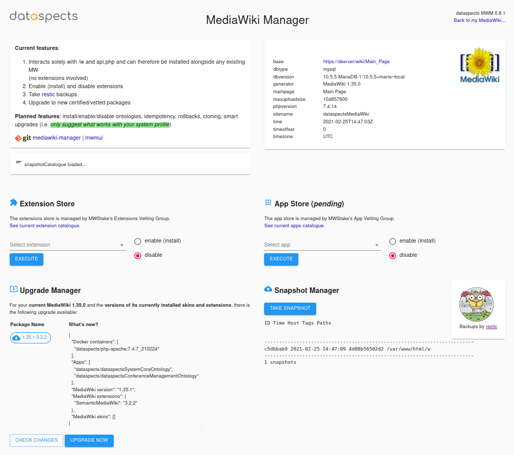
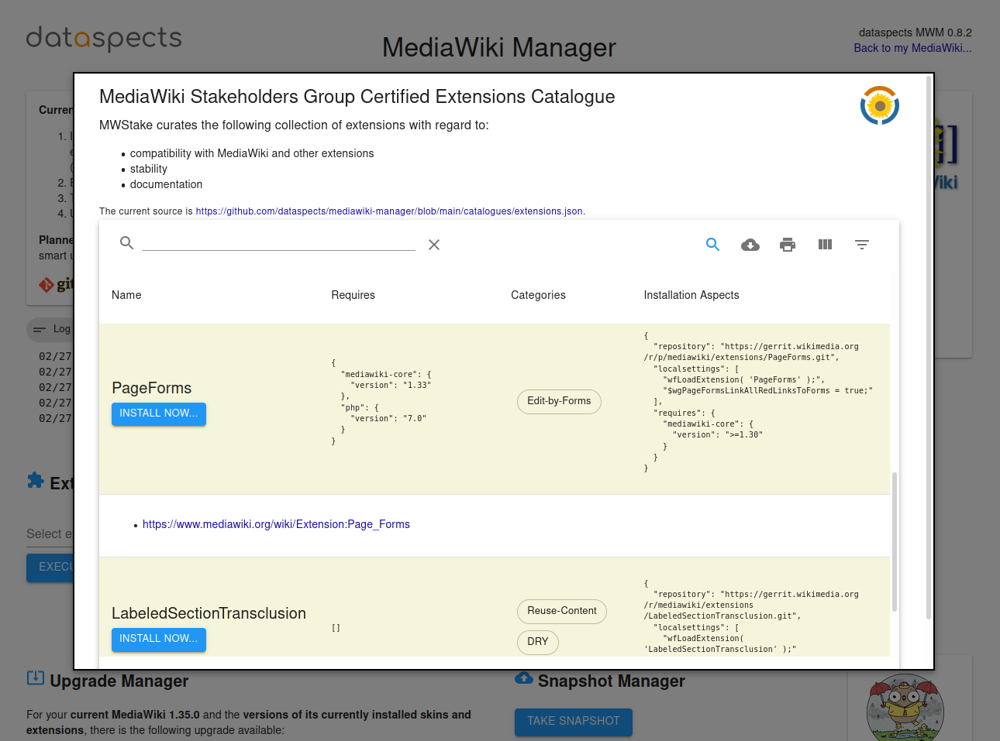

# mediawiki-manager

This repository represents the development workbench for [MWStake MediaWiki Manager](https://mwstake.org/mwstake/wiki/MWStake_MediaWiki_Manager).

***It is not meant to be used in production (yet)!***

## System Requirements

At the moment MWM is only being tested on Ubuntu 20.04 running [Podman](https://podman.io/).

## Features

General features across abstraction layers:

1. LocalSettings.php backups in `w/LocalSettingsPHPBACKUP`

### Feature: Install System Instance

#### [Abstraction Layer ALcli](https://mwstake.org/mwstake/wiki/MWStake_MediaWiki_Manager#Abstraction_Layers)

1. `user@server:~$ git clone https://github.com/dataspects/mediawiki-manager.git`
2. `user@server:~$ cd mediawiki-manager`
3. Configure `~/mediawiki-manager/envs/my-new-system.env`
4. `user@server:~/mediawiki-manager$ ./cli/install-system/install-system.sh`

#### [Abstraction Layer ALapi](https://mwstake.org/mwstake/wiki/MWStake_MediaWiki_Manager#Abstraction_Layers)
TBD
#### [Abstraction Layer ALui](https://mwstake.org/mwstake/wiki/MWStake_MediaWiki_Manager#Abstraction_Layers)
TBD

### Feature: Operate System Instance

#### [Abstraction Layer ALcli](https://mwstake.org/mwstake/wiki/MWStake_MediaWiki_Manager#Abstraction_Layers)

* `user@server:~/mediawiki-manager$ ./cli/view-logs.sh`
* `user@server:~/mediawiki-manager$ ./cli/manage-system/start.sh`
* `user@server:~/mediawiki-manager$ ./cli/manage-system/stop.sh`
* `user@server:~/mediawiki-manager$ ./cli/manage-system/restart.sh`
* `user@server:~/mediawiki-manager$ ./cli/manage-system/start-SAFE-MODE.sh`

#### [Abstraction Layer ALapi](https://mwstake.org/mwstake/wiki/MWStake_MediaWiki_Manager#Abstraction_Layers)
TBD
#### [Abstraction Layer ALui](https://mwstake.org/mwstake/wiki/MWStake_MediaWiki_Manager#Abstraction_Layers)
TBD
### Feature: System Instance Snapshots

#### [Abstraction Layer ALcli](https://mwstake.org/mwstake/wiki/MWStake_MediaWiki_Manager#Abstraction_Layers)

* `user@server:~/mediawiki-manager$ ./cli/system-snapshots/take-restic-snapshot.sh`
* `user@server:~/mediawiki-manager$ ./cli/system-snapshots/view-restic-snapshots.sh`

#### [Abstraction Layer ALapi](https://mwstake.org/mwstake/wiki/MWStake_MediaWiki_Manager#Abstraction_Layers)
TBD
#### [Abstraction Layer ALui](https://mwstake.org/mwstake/wiki/MWStake_MediaWiki_Manager#Abstraction_Layers)
TBD

### Feature: Extension Management

Common features across abstraction layers:

1. With regard to the idea of a [MediaWiki Stakeholders Group Certified Extensions Service](https://mwstake.org/mwstake/wiki/MWStake_MediaWiki_Manager#MediaWiki_Stakeholders_Group_Certified_Extensions_Service), available extensions are organized in a [catalog](https://raw.githubusercontent.com/dataspects/mediawiki-manager/main/catalogues/extensions.json) from which extensions can/shall/must be chosen.
2. Handle composer-based, repository-based and enable-only extensions

#### [Abstraction Layer ALcli](https://mwstake.org/mwstake/wiki/MWStake_MediaWiki_Manager#Abstraction_Layers)

* `user@server:~/mediawiki-manager$ ./cli/manage-extensions/show-extension-catalogue.sh`
* `user@server:~/mediawiki-manager$ podman exec mwm-mediawiki ./cli/manage-extensions/enable-extension.sh "PageForms"` (Example for "PageForms")
* `user@server:~/mediawiki-manager$ podman exec mwm-mediawiki ./cli/manage-extensions/disable-extension.sh "PageForms"` (Example for "PageForms")

#### [Abstraction Layer ALapi](https://mwstake.org/mwstake/wiki/MWStake_MediaWiki_Manager#Abstraction_Layers)
TBD
#### [Abstraction Layer ALui](https://mwstake.org/mwstake/wiki/MWStake_MediaWiki_Manager#Abstraction_Layers)
TBD

### Feature: Manage Content

#### [Abstraction Layer ALcli](https://mwstake.org/mwstake/wiki/MWStake_MediaWiki_Manager#Abstraction_Layers)

The following command asks for ontologies organized in accordance with the dataspects ontology repository structure, e.g. https://github.com/dataspects/dataspectsSystemCoreOntology, and injects all ontology pages into the wiki:

`user@server:~/mediawiki-manager$ ./cli/manage-content/inject-ontology-WikiPageContents.sh`

## Implementation/abstraction levels

Ultimately, MWM will provide 3 implementation levels with regards to the features it provides:

### Containerization: Podman

### CLI: Bash

The bash cli can be extracted and used independently as a standalone cli. The following command will place a standalone cli next to mediawiki-manager. Please note that not all cli functionality is available.

`user@server:~/mediawiki-manager$ ./extract-standalone-cli.sh`

Then use it like this:

`user@server:~/standalonecli$ ./cli/manage-content/inject-ontology-WikiPageContents.sh` (see below "Feature: Manage Content" for more information on this command)

### API: Go REST
TBD, partly implemented at https://github.com/dataspects/mwmapi
### UI: React/Material-UI
TBD, partly implemented at https://github.com/dataspects/mwmui
