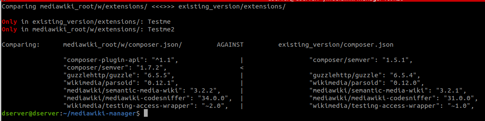

# mediawiki-manager

This repository represents the development workbench for [MWStake MediaWiki Manager](https://mwstake.org/mwstake/wiki/MWStake_MediaWiki_Manager).

***It is not meant to be used in production (yet)!***

## Features

### Implementation/abstraction levels

Ultimately, MWM will provide 3 implementation levels with regards to the features it provides:

#### Bash CLI

The bash cli can be extracted and used independently as a standalone cli. The following command will place a standalone cli next to mediawiki-manager. Please note that not all cli functionality is available.

`user@server:~/mediawiki-manager$ ./extract-standalone-cli.sh`

The use it like this:

`user@server:~/standalonecli$ ./cli/manage-content/inject-ontology-WikiPageContents.sh` (see below "Feature: Manage Content" for more information on this command)

#### Go REST API
TBD, partly implemented at https://github.com/dataspects/mwmapi
#### React/Material-UI UI
TBD, partly implemented at https://github.com/dataspects/mwmui
### Feature: Install System Instance

#### [Abstraction Layer ALcli](https://mwstake.org/mwstake/wiki/MWStake_MediaWiki_Manager#Abstraction_Layers)

1. `user@server:~$ git clone https://github.com/dataspects/mediawiki-manager.git`
2. `user@server:~$ cd mediawiki-manager`
3. Configure `~/mediawiki-manager/envs/my-new-system.env`
4. `user@server:~/mediawiki-manager$ ./cli/install-system/install-system.sh`

#### [Abstraction Layer ALapi](https://mwstake.org/mwstake/wiki/MWStake_MediaWiki_Manager#Abstraction_Layers)
TBD
#### [Abstraction Layer ALui](https://mwstake.org/mwstake/wiki/MWStake_MediaWiki_Manager#Abstraction_Layers)
TBD

### Feature: Operate System Instance

#### [Abstraction Layer ALcli](https://mwstake.org/mwstake/wiki/MWStake_MediaWiki_Manager#Abstraction_Layers)

* `user@server:~/mediawiki-manager$ ./cli/view-logs.sh`
* `user@server:~/mediawiki-manager$ ./cli/manage-system/start.sh`
* `user@server:~/mediawiki-manager$ ./cli/manage-system/stop.sh`
* `user@server:~/mediawiki-manager$ ./cli/manage-system/restart.sh`
* `user@server:~/mediawiki-manager$ ./cli/manage-system/start-SAFE-MODE.sh`

#### [Abstraction Layer ALapi](https://mwstake.org/mwstake/wiki/MWStake_MediaWiki_Manager#Abstraction_Layers)
TBD
#### [Abstraction Layer ALui](https://mwstake.org/mwstake/wiki/MWStake_MediaWiki_Manager#Abstraction_Layers)
TBD
### Feature: System Instance Snapshots

#### [Abstraction Layer ALcli](https://mwstake.org/mwstake/wiki/MWStake_MediaWiki_Manager#Abstraction_Layers)

* `user@server:~/mediawiki-manager$ ./cli/system-snapshots/take-restic-snapshot.sh`
* `user@server:~/mediawiki-manager$ ./cli/system-snapshots/view-restic-snapshots.sh`

#### [Abstraction Layer ALapi](https://mwstake.org/mwstake/wiki/MWStake_MediaWiki_Manager#Abstraction_Layers)
TBD
#### [Abstraction Layer ALui](https://mwstake.org/mwstake/wiki/MWStake_MediaWiki_Manager#Abstraction_Layers)
TBD

### Feature: Manage Content

#### [Abstraction Layer ALcli](https://mwstake.org/mwstake/wiki/MWStake_MediaWiki_Manager#Abstraction_Layers)

The following command asks for ontologies organized in accordance with the dataspects ontology repository structure, e.g. https://github.com/dataspects/dataspectsSystemCoreOntology, and injects all ontology pages into the wiki:

`user@server:~/mediawiki-manager$ ./cli/manage-content/inject-ontology-WikiPageContents.sh`
<!-- ### Extensions

...

### Content

* `mediawiki-manager/cli/inject-local-WikiPageContents`: inject content from `WikiPageContents/`
* `mediawiki-manager/cli/inject-ontology-WikiPageContents.sh`: inject content from ontology repositories, e.g. https://github.com/dataspects/dataspectsSystemCoreOntology

## Switch (Upgrade)

...

### Check what has changed

## MWM Factory

* See https://github.com/dataspects/mwmui.
* Docker images are built by https://github.com/dataspects/dataspectsSystemBuilder.
### Develop MWM UI

1. `user@workstation:~/mwmui$ gatsby develop -H 0.0.0.0`
2. `user@workstation:~/mediawiki-manager$ cp mwmapi/* mediawiki_root/api/` for all changes in `mwmapi/`

### Locally test production MWM UI

* `user@workstation:~/mwmui$ gatsby build --prefix-paths && cp -r public/* ../mediawiki-manager/mediawiki_root/ui`

### Deploy production MWM UI

1. `user@workstation:~/mwmui$ gatsby build --prefix-paths && cp -r public/* ../mediawiki-manager/mwmui`
2. `user@workstation:~/mediawiki-manager$ # git commit ...`

## TODOs

* Handle trailing slashes present or not -->